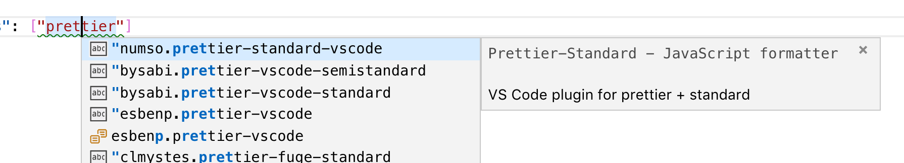
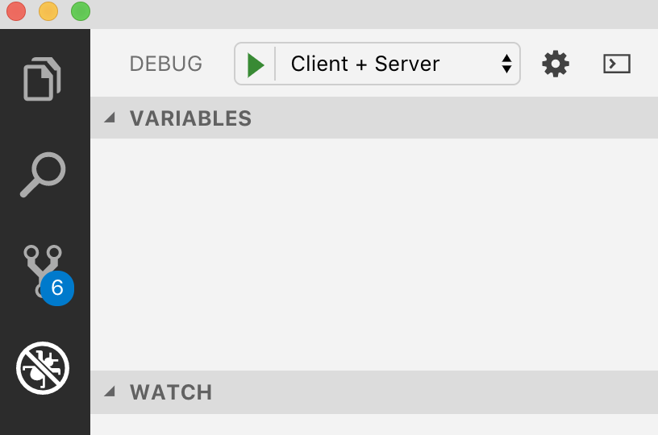
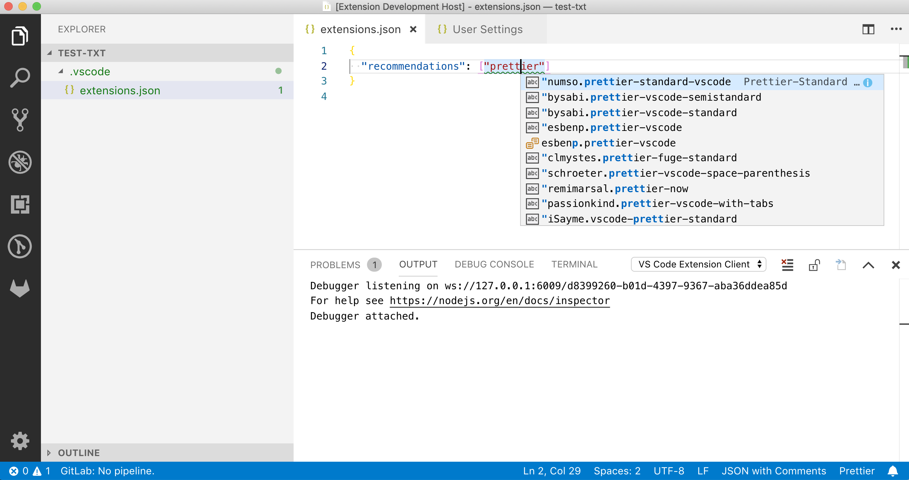

⚠️ WORK IN PROGRESS ⚠️

# How to create a language server and VS Code extension

[](https://travis-ci.org/donaldpipowitch/how-to-create-a-language-server-and-vscode-extension)

> This project offers a small language server for `.vscode/extensions.json` files.

This `README.md` is written as a tutorial in which I'll explain how the `@donaldpipowitch/vscode-extension-*` project was created. This should be helpful, if you want to create a similar project or if you want to contribute to this project.

If you're just interested in _using_ the `@donaldpipowitch/vscode-extension-*` packages, you'll find the usage information in their corresponding `README.md`'s.

| Package                                                                 | Description                                                                                    |
| ----------------------------------------------------------------------- | ---------------------------------------------------------------------------------------------- |
| [`@donaldpipowitch/vscode-extension-core`](packages/core/README.md)     | Exports some useful APIs to get information about VS Code extensions.                          |
| [`@donaldpipowitch/vscode-extension-server`](packages/server/README.md) | A `.vscode/extensions.json` language server.                                                   |
| [`vscode-extensions-files`](packages/client/README.md)                  | A client for the `.vscode/extensions.json` language server. The client is a VS Code extension. |

💡 In case you are wondering about the package name for the VS Code extension: VS Code extensions aren't published to npm, but to the _Visual Studio Code Marketplace_. They slightly differ from your usual package (and don't allow [_scoped package names_](https://docs.npmjs.com/misc/scope) for example). Luckily you'll learn more about that

# Table of contents

1. [Background](#background)
2. [Goal of this language server](#goal-of-this-language-server)
3. [Initial setup](#initial-setup)
4. [Basic project structure](#basic-project-structure)
5. [Creating `@donaldpipowitch/vscode-extension-core` and add search](#creating-donaldpipowitchvscode-extension-core-and-add-search)
6. [Creating `@donaldpipowitch/vscode-extension-server` and add code completion](#creating-donaldpipowitchvscode-extension-server-and-add-code-completion)
7. [Creating `vscode-extensions-files` and test everything](#creating-vscode-extensions-files-and-test-everything)
8. [Our first release](#our-first-release)

## Background

In this article you will learn how you can create a language server and a VS Code extension which uses this language server. A language server adds features like _autocomplete_, _go to definition_ or _documentation on hover_ to a programming language, to domain specific languages, but also to frameworks and configuration files, if it can't be covered by the underlying language alone.

[VS Code](https://code.visualstudio.com/) is a nice and extensible open source editor. We'll create an extension for VS Code which will use our custom language server. While language servers are editor agnostic we'll create a language server for a VS Code specific feature. So in this case it only makes sense to use it in the context of VS Code.

There are already existing tutorials which cover this topic. The best tutorial probably was created by the Microsoft team itself which is responsible for VS Code and the [language server protocol](https://microsoft.github.io/language-server-protocol/) which powers all language servers. You can find [Microsofts tutorial here](https://code.visualstudio.com/docs/extensions/example-language-server). Nevertheless I write my own tutorial for two reasons. First I write this tutorial for myself, so I can learn the concepts and the APIs in my own pace. Second I write it for _you_, because sometimes it helps to get a _similar_ tutorial for the same topic from a different perspective. For example my tooling, my project structure and my writing style will be slightly different. And sometimes this already helps learning something new!

The language server we'll create and the corresponding VS Code extension will add some nice functionality to `.vscode/extensions.json` files. If you don't know them, no worries. I'll explain them in the next section.

I expect you to have some intermediate knowledge in Node development. This project will be written in [TypeScript](https://www.typescriptlang.org), we use [Jest](https://jestjs.io/) for testing and [yarn](https://yarnpkg.com/) as our package manager.

## Goal of this language server

`.vscode/extensions.json` files in the root of a project are VS Code specific configuration files. They can contain recommendations for extensions which should be used in this projects as well as recommendations of extensions which should _not_ be used. If a user of VS Code opens the project the editor asks the user if he/she wants to install missing recommended extensions or to disable unwanted, but already installed extensions.

Out of the box VS Code already offers code completion and validation for the interface (`{ recommendations: string[], unwantedRecommendations: string[] }`) of these files. The code completion for `recommendations[]`/`unwantedRecommendations[]` even shows you currently installed extensions. What is _missing_?

- code completion for extensions which aren't installed locally
- on hover documentation for an extension (**TODO**)
- got to definitions for an extension (**TODO**)

We try to add these three features in this tutorial.

## Initial setup

The project was tested and developed with following technologies:

- [VS Code](https://code.visualstudio.com/) (I used `1.30.0-insider`)
- [Node](https://nodejs.org/en/) (I used `8.14.0`, because VS Code currently bundles `node@8` _AFAIK_)
- [yarn](https://yarnpkg.com/en/docs/install) (I used `1.12.3`)
- [Git](https://git-scm.com/) (I used `2.18.0`)

If you have these requirements installed, you can setup the project with the following steps:

1. `$ git clone https://github.com/donaldpipowitch/how-to-create-a-language-server-and-vscode-extension.git`
2. `$ cd how-to-create-a-language-server-and-vscode-extension`
3. `$ yarn`

## Basic project structure

Before we dive into one of our packages I'll give you a short overview about the whole project structure.

- [`README.md`](README.md): The very file you're currently reading. It serves as a tutorial for the whole project.
- [`LICENSE`](LICENSE): This project uses the [MIT license](https://opensource.org/licenses/MIT).
- [`.vscode/extensions.json`](.vscode/extensions.json): This project has a VS Extension recommendation, too. See the following file:
- [`prettier.config.js`](prettier.config.js): We use [Prettier](https://prettier.io/) for code formatting and this is the corresponding [config file](https://prettier.io/docs/en/configuration.html).
- [`.prettierignore`](.prettierignore): With this file Prettier will not format generated files.
- [`.gitignore`](.gitignore): We ignore dependencies and meta data/generated files in Git. See [here](https://git-scm.com/docs/gitignore) to learn more.
- [`package.json`](package.json): This file contains our [workspace configuration](https://yarnpkg.com/lang/en/docs/workspaces/), because our projects contains _multiple_ packages. It also contains top-level dependencies and commands like `build` and `lint`. (The `lint` command will run Prettier.)
- [`.travis.yml`](.travis.yml): This is the config file for [Travis](https://travis-ci.org/), our [CI system](https://martinfowler.com/articles/continuousIntegration.html). We'll build, lint and test our code on every commit. You can find our CI logs [here](https://travis-ci.org/donaldpipowitch/how-to-create-a-language-server-and-vscode-extension).
- [`.vscode/settings.json`](.vscode/settings.json): This file contains some shared VS Code configs. You'll get these settings automatically, if you open this project with VS Code.
- [`.vscode/launch.json`](.vscode/launch.json): This file contains some script/launch configurations which we'll need later on for debugging purposes. I'll explain this in more detail later in the article.
- [`tsconfig.base.json`](tsconfig.base.json): This file contains our shared TypeScript configs. I just want to point out, that I always try to use [`strict: true`](https://blog.mariusschulz.com/2017/06/09/typescript-2-3-the-strict-compiler-option) for better type safety and `"types": []` to not load _every_ `@types/*` package by default (to avoid having `@types/jest` interfaces available in my non-test files for example).
- [`yarn.lock`](yarn.lock): This file contains the last known working versions of our dependencies. Read [here](https://yarnpkg.com/lang/en/docs/yarn-lock/) to learn more.

Our configurations and meta files out of the way we'll have a look into the [`packages/`](packages) directory. This directory contains all the packages which we briefly explained above:

- [`packages/core`](packages/core): This directory contains `@donaldpipowitch/vscode-extension-core`.
- [`packages/server`](packages/server): Here we can find `@donaldpipowitch/vscode-extension-server`.
- [`packages/client`](packages/client): Last, but not least - `vscode-extensions-files`.

Maybe you are wondering why we have a `core` package and not just the server and the client (which is our extension)? Many frameworks and tools add language server on top of their original functionality. Think of ESLint (https://eslint.org/) which works standalone from the ESLint language server (https://github.com/Microsoft/vscode-eslint/blob/master/server). We do the same. This is useful so others can build on top of our logic - but without the need to load language server specific dependencies. This could be useful for small libs and CLIs. Besides that it makes it easier to show you which part of code is actually language server specific and which not.

Let's start with our `core` package.

## Creating `@donaldpipowitch/vscode-extension-core` and add search

The core package exports a function called `search` which takes a search value to look for VS Code extensions. We actually use the _Visual Studio MarketPlace API_ here, which is **not public** and **could break at any time** ([not just my words](https://twitter.com/ErichGamma/status/1029758007272505350)). You normally probably wouldn't want to rely on this, but for the sake of a tutorial it should be fine.

We'll use [`axios`](https://github.com/axios/axios) to make requests against the MarketPlace API and we want the caller of our `search` function to be able to _cancel_ our request, so we'll return not just an awaitable `request` object (which fulfills to an array of extensions on success), but also a `cancel` method. If the caller calls `cancel` the `request` will be fulfilled as `undefined`. All in all the request should be relatively straightforward if you used `axios` before.

This is our [`src/search.ts`](packages/core/src/search.ts):

```ts
import axios, { Canceler } from 'axios';

export { Canceler };

/**
 * In the `.vscode/extensions.json` we'll need to use `${publisher.publisherName}.${extensionName}`.
 *
 * @example
 * {
 *   "publisher": {
 *     "publisherId": "d16f4e39-2ffb-44e3-9c0d-79d873570e3a",
 *     "publisherName": "esbenp",
 *     "displayName": "Esben Petersen",
 *     "flags": "none"
 *   },
 *   "extensionId": "96fa4707-6983-4489-b7c5-d5ffdfdcce90",
 *   "extensionName": "prettier-vscode",
 *   "displayName": "Prettier - Code formatter",
 *   "flags": "validated, public",
 *   "lastUpdated": "2018-08-09T12:05:04.413Z",
 *   "publishedDate": "2017-01-10T19:52:02.703Z",
 *   "releaseDate": "2017-01-10T19:52:02.703Z",
 *   "shortDescription": "VS Code plugin for prettier/prettier",
 *   "deploymentType": 0
 * }
 */
export type Extension = {
  publisher: {
    publisherId: string;
    publisherName: string;
    displayName: string;
    flags: string;
  };
  extensionId: string;
  extensionName: string;
  displayName: string;
  flags: string;
  lastUpdated: string;
  publishedDate: string;
  releaseDate: string;
  shortDescription: string;
  deploymentType: number;
};

export type SearchRequest = {
  cancel: Canceler;
  request: Promise<Extension[] | void>;
};

export function search(value: string): SearchRequest {
  const { token, cancel } = axios.CancelToken.source();
  const options = {
    cancelToken: token,
    url:
      'https://marketplace.visualstudio.com/_apis/public/gallery/extensionquery',
    method: 'post',
    headers: {
      accept: 'application/json;api-version=5.0-preview.1;excludeUrls=true'
    },
    data: {
      filters: [
        {
          criteria: [
            // which visual studio app? code
            { filterType: 8, value: 'Microsoft.VisualStudio.Code' },
            // our search value
            { filterType: 10, value }
          ],
          pageSize: 10,
          pageNumber: 1
        }
      ]
    }
  };
  const request = axios(options)
    .then(({ data }) => data.results[0].extensions as Extension[])
    .catch((error) => {
      if (!axios.isCancel(error)) {
        throw error;
      }
    });
  return { request, cancel };
}
```

Our [`src/index.ts`](packages/core/src/index.ts) just takes care of re-exporting this:

```ts
export * from './search';
```

For the sake of completeness we also have [`src/tsconfig.json`](packages/core/src/tsconfig.json) which extends from our [`tsconfig.base.json`](tsconfig.base.json) in our project root and takes care of setting our output directory.

Our [`package.json`](packages/core/package.json) is also quite straightforward as it doesn't contain any language server specific metadata. The package can be build by calling `$ yarn build` or `$ yarn watch`.

You can easily test our package, if you build our package, run `node` inside `packages/core` and try out our package like this (and press `Ctrl+C` twice at the end to exit again):

```
$ cd packages/core
$ yarn build
$ node
> require('./dist').search('prettier').request.then(console.log)
```

This requires our package, calls `search` with the value `'prettier'` and `console.log`'s the result.

I'll also add some small unit tests. We'll use [Jest](https://jestjs.io/) as our testing framework. Together with the [`ts-jest`](https://github.com/kulshekhar/ts-jest) our Jest config in [`tests/jest.config.js`](packages/core/tests/jest.config.js) is quite small. We just configured `testMatch` to treat every `.ts` file inside `tests/` as a test file and we configured `testPathIgnorePatterns` to exclude the `__fixture__` directory. (I use fixtures in a similar way as explained in [this article](https://dev.to/davidimoore/using-fixtures-for-testing-a-reactredux-app-with-jest--enzyme-3hd0). For me a fixture is just some static data, so I haven't put it into the typicals `__mocks__` directory, because I don't mock the implementation of some module here, which is how mocks are [usually defined in Jest](https://jestjs.io/docs/en/manual-mocks).) Note that we also have a [`tests/tsconfig.json`](packages/core/tests/tsconfig.json) so we can add Jest type declarations to our tests.

[This](packages/core/tests/search.ts) is our test for the search API:

```ts
import axios from 'axios';
import MockAdapter from 'axios-mock-adapter';
import { search } from '../src/search';
import { prettier } from './__fixtures__/search-response';

const mock = new MockAdapter(axios);

test('should search extensions', async () => {
  mock.onAny().replyOnce(200, prettier);
  expect(await search('prettier').request).toMatchSnapshot();
});

test('should cancel search', async () => {
  mock.onAny().replyOnce(200, prettier);
  const { request, cancel } = search('prettier');
  cancel();
  expect(await request).toBe(undefined);
});
```

This will test a search and the cancelation of a search. The imported [`prettier` object](packages/core/tests/__fixtures__/search-response.ts) is actually the saved response of a real search request against the API with the search query `'prettier'`.

## Creating `@donaldpipowitch/vscode-extension-server` and add code completion

The server package creates language server which offers code completion functionality for VS Code extensions in `.vscode/extensions.json` files.

We'll use [`vscode-languageserver`](https://github.com/Microsoft/vscode-languageserver-node) which is a framework to create a language server. AFAIK it is not _tied_ to VS Code, it was only created by the VS Code team. The description also just says that it is a [_"Language server implementation for node"_](https://github.com/Microsoft/vscode-languageserver-node/blob/3c48412e5f019ddc61a43cc2e0ed3bbcfd08696c/server/package.json#L3). Additionally we'll use [`jsonc-parser`](https://github.com/Microsoft/node-jsonc-parser) to parse our `.vscode/extensions.json` file. (By the way, JSONC is JSON with comments.) We need this to check if the user requests a code completion for an item in `recommendations[]`/`unwantedRecommendations[]` or if the user requests a code completion for someting completely different.

Structure and config wise (e.g. the `src/tsconfig.json`, `package.json`, the unit tests) is similar to the [core package](#creating-donaldpipowitchvscode-extension-core-and-add-search).

Let's have a look at our [`src/index.ts`](packages/server/src/index.ts). This should give us a good overview of what happens in this package:

```ts
import { connection, documents } from './setup';
import { configureCompletion } from './completion';

configureCompletion(connection, documents);
```

As you can see we import a `connection` and `documents` from some setup file and pass them to a function called `configureCompletion`. So what are `connection`, `documents` and `configureCompletion` exactly?

`connection` and `documents` are terms coming from the `vscode-languageserver` package. A connection - in my understanding - is the actual _server_ we think of when we say _language server_. The connection takes requests from a client and responds to them. A connection can take some configurations as you will soon see. For example a connection can say that it offers certain features (called _capabilities_) like code completion. `documents` is an instance of `TextDocuments` which is exported by `vscode-languageserver`. As far as I understand the `TextDocuments` syncs which files have been opened/changed/closed between the client and the server. We use it to retrieve our `.vscode/extensions.json`.

Let's have a look at [`src/setup.ts`](packages/server/src/setup.ts) first:

```ts
import { createConnection, TextDocuments } from 'vscode-languageserver';

const connection = createConnection();

// text document manager (supports full document sync only)
const documents = new TextDocuments();

connection.onInitialize(() => ({
  // tells the client what we support:
  // - full text sync
  // - code completion
  capabilities: {
    textDocumentSync: documents.syncKind,
    completionProvider: {
      triggerCharacters: [
        ...'abcdefghijklmnopqrstuvwxyzABCDEFGHIJKLMNOPQRSTUVWXYZ-_"'
      ]
    }
  }
}));

// Listen for events
documents.listen(connection);
connection.listen();

export { connection, documents };
```

As I said earlier we create a `connection` (our actually server) and an instance of `TextDocuments` (to let our server know which documents are opened and changed in the client). We set an `onInitialize` handler which returns a configuration which contains `capabilities`. These `capabilities` tell the client which features our server supports. With `textDocumentSync: documents.syncKind` we tell the client that we support _full text syncs_ (e.g. the whole document is synced between client and server) and with `completionProvider` we tell the client that our server offers code completion (as you'll soon see). Inside `completionProvider` we also specify all characters which trigger a completion. This are basically `a` to `Z`, `-` and `_` which can be part of the extension name as well as `"` which seems to be treated [as a part of a word in JSON](<(https://github.com/Microsoft/vscode-extension-samples/issues/93#issuecomment-429849514)>) (and our string begins with `"`). (⚠️ Disclaimer: I'm not enterily sure, if this is the correct way to do it, but only with this setting I could get reliable _complete while you type_ behaviour.)

After that we pass `connection` to our `documents` (with `documents.listen(connection)`) and tell the `connection` to listen for any requests from any client. At the end both are exported, so we can use them inside [`src/index.ts`](packages/server/src/index.ts) as we saw earlier.

Now let's have a look at [`src/completion.ts`](packages/server/src/completion.ts) and we do it in _two parts_. First well have a look at tge exported `configureCompletion` function which was already used inside [`src/index.ts`](packages/server/src/index.ts):

```ts
import { search, Canceler } from '@donaldpipowitch/vscode-extension-core';
import {
  TextDocuments,
  CompletionItemKind,
  Connection
} from 'vscode-languageserver';
import { parseTree, findNodeAtOffset, Node } from 'jsonc-parser';

let lastCancel: Canceler | null = null;

export function configureCompletion(
  connection: Connection,
  documents: TextDocuments
) {
  // The onCompletion handler provides the initial list of the completion items.
  // This is an example of the params passed to the handler:
  // {
  //   "textDocument": {
  //     "uri": "file:///Users/pipo/workspace/test-txt/test.txt"
  //   },
  //   "position": {
  //     "line": 0,
  //     "character": 10
  //   },
  //   "context": {
  //     "triggerKind": 1
  //   }
  // }
  connection.onCompletion(async ({ position, textDocument }) => {
    if (lastCancel) {
      lastCancel();
      lastCancel = null;
    }

    if (!textDocument.uri.endsWith('.vscode/extensions.json')) return;

    const document = documents.get(textDocument.uri);
    if (!document) return;

    const tree = parseTree(document.getText());
    const node = findNodeAtOffset(tree, document.offsetAt(position));

    if (!isExtensionValue(node)) return;

    // only search for queries with at least three characters
    if (node.value && node.value.length <= 2) return;

    const query = node.value;
    // connection.console.log(`You searched for ${query}.`);

    const { cancel, request } = search(query);
    lastCancel = cancel;

    const extensions = await request;
    lastCancel = null;

    if (!extensions) return;

    const completionItems = extensions.map(
      ({
        publisher: { publisherName },
        extensionName,
        displayName,
        shortDescription
      }) => ({
        // `"` hack, because JSON treats `"` as part of the completion here
        // see https://github.com/Microsoft/vscode-extension-samples/issues/93#issuecomment-429849514
        label: `"${publisherName}.${extensionName}`,
        kind: CompletionItemKind.Text,
        detail: displayName,
        documentation: shortDescription
      })
    );

    return completionItems;
  });
}
```

That is a lot to cover! Let's try to break it down a little bit.

`configureCompletion` has just one purpose: set a `onCompletion` handler on our `connection`. A client can basically ask at any time for any file on any position for possible _completion items_ (e.g. suggestion about what could be completed). Because it can happen at any time and because I search can take an unknown time to resolve, we check if there is a pending search (`if (lastCancel) {}`) and if there is a pending search, we cancel it.

To handle the clients request correctly we get the `position` (e.g. the cursor position) and the `textDocument.uri` (basically the "file name"). With these two params we can check, if the client requests completion items for a `.vscode/extensions.json` file and the values of `recommendations[]` or `unwantedRecommendations[]`. If it is a different file we return early. If it _is_ a `.vscode/extensions.json` file we try to get its content - if it is not available we return as well. If we have the files content, we try to parse it (`const tree = parseTree(document.getText())`).

So what is `tree`? This is the [abstract syntax _tree_](https://en.wikipedia.org/wiki/Abstract_syntax_tree) (or AST in short) which represents our JSON file in a way that it can be programmatically searched for example. With our `position` we can get the `node` inside the `tree` which the cursor position of the user currently highlights. The `node` is like an element inside the tree which can represent different things: a string value or an array or the property of an object or a comment... basically every language feature JSON(C) can support.

We pass the `node` to a function called `isExtensionValue()`. We'll look at this function in a moment. For now you should only know that this function returns `true`, if `node` represents a string value inside `recommendations[]` or `unwantedRecommendations[]`. With other words: given a JSON file like `{ "recommendations": ["some-value"] }` than `isExtensionValue()` returns `true`, if the cursor is somewhere inside `"some-value"` and it returns `false` in all other cases.

If our `node` is the value of an extension we check if it is at least two characters long, before we try to run a search.

When we run the search, we save the `cancel` handler. Remember our initial check - if the search takes a long time and the client already asks for the next completion items we'll cancel the old search. When the search has finished we reset the `cancel` handler. Another thing to remember: if we canceled a search request than the request will be resolved to `undefined` and we just stop any further processing.

Great! As our last step we just need to map our `extension`'s from the API to a _completion item_. The `kind` is `CompletionItemKind.Text` which means our completion item just represents some text (instead of something like a function a file or something like that). `label` is the actual value we want to complete to. It is basically `${publisherName}.${extensionName}`, but with a caveat - we need to prepend a `"`. You can find some discussion about this caveat [here](https://github.com/Microsoft/vscode-extension-samples/issues/93#issuecomment-429849514). Apparently the `"` is treated as a part of the completable value. I'm not sure if this is a bug or not, but we need to respect it. `detail` acts like a _title_ in the extended view of the completion UI while `documentation` acts like a small _description_ below the _title_.

Note that the completion can be either triggered just by writing or by pressing `Ctrl` and `Space` (at least with your default settings).



Congratualions. Take a deep breath, make a small pause and maybe re-read the last section.

Now let's have a look at the implementation of `isExtensionValue()`:

```ts
function isExtensionValue(node: Node | undefined): node is Node {
  // no node
  if (!node) return false;
  // not a string node
  if (node.type !== 'string') return false;
  // not within an array
  if (!node.parent) return false;
  if (node.parent.type !== 'array') return false;
  // not on a "recommendations" or "unwantedRecommendations" property
  if (!node.parent.parent) return false;
  if (node.parent.parent.type !== 'property') return false;
  if (
    node.parent.parent.children![0].value !== 'recommendations' &&
    node.parent.parent.children![0].value !== 'unwantedRecommendations'
  )
    return false;
  // not on an object
  if (!node.parent.parent.parent) return false;
  if (node.parent.parent.parent.type !== 'object') return false;
  // not the root
  if (node.parent.parent.parent.parent) return false;
  // whoohoo
  return true;
}
```

This looks a little bit complicated, but should actually be quite straightforward. We just make sure our `node` exists, is a string inside an array of a prop which is called `recommendations` or `unwantedRecommendations` of an object in the root. If yes, we return `true`.

The only thing left for the server are a couple of small unit tests for the code completion which you can find [here](packages/server/tests/completion.ts). The completion logic depends on three things: our `connection`, our `documents` and our `search` from the `core`. We'll need to mock these three things in a `setup` function which we can call inside every test. For the `search` we'll use a fixture of a saved search for _"prettier"_ which you can find [here](packages/server/tests/__fixtures__/search.ts). `documents` will just return some `text` and `offset` which we can pass into `setup` - these are _the only things_ which we'll change between tests for now. The interesting part is in the mock for `connection`. Here we use the `onCompletion` mock to retrieve our actual `completionHandler`, so we can call it manually inside a test. This is our final `setup`:

```ts
import * as core from '@donaldpipowitch/vscode-extension-core';
import { configureCompletion } from '../src/completion';
import { prettier } from './__fixtures__/search';

const setup = ({ text, offset }: { text: string; offset: number }) => {
  const search = jest.spyOn(core, 'search');
  let resolve: Function;
  const request = new Promise((_resolve) => (resolve = _resolve));
  const cancel = jest.fn(() => resolve());
  search.mockReturnValue({ cancel, request });

  const mockedConnection = { onCompletion: jest.fn() };
  const mockedDocuments = {
    get() {
      return {
        getText() {
          return text;
        },
        offsetAt() {
          return offset;
        }
      };
    }
  };
  configureCompletion(mockedConnection as any, mockedDocuments as any);

  expect(mockedConnection.onCompletion).toHaveBeenCalledTimes(1);
  const completionHandler = mockedConnection.onCompletion.mock.calls[0][0];

  return {
    callCompletionHandler: () =>
      completionHandler({
        textDocument: { uri: '.vscode/extensions.json' }
      }),
    resolveSearch: () => resolve(prettier),
    cancelSearch: cancel
  };
};
```

This is surely not the best code ever written, but it makes our tests quite readable.

In this test for example we check for the succesful completion of a `prettier` search. We prepare our JSON file (`text`) and the cursor position (`offset`). We ask for completion items (`callCompletionHandler`), "wait" for the search (`resolveSearch`) and `await` the completion items (`itemsPromise`):

```ts
test('should provide completion items (search "prettier")', async () => {
  const text = '{"recommendations": ["prettier"]}';
  const offset = 21; // the `"`, before `prettier"]`

  const mocks = setup({ text, offset });

  const itemsPromise = mocks.callCompletionHandler();
  mocks.resolveSearch();
  expect(await itemsPromise).toMatchSnapshot();
});
```

For more examples you can have a look at the [test file](packages/server/tests/completion.ts) (- they all look quite similar).

## Creating `vscode-extensions-files` and test everything

The client package creates our VS Code extension and uses the language server. This package contains IDE-specific logic - in this case for VS Code.

Let's begin with the [`package.json`](packages/client/package.json) this time, which contains some VS Code specific properties which I'll briefly explain. You can find all properties with descriptions and their allowed values [here](https://code.visualstudio.com/docs/extensionAPI/extension-manifest).

```json
{
  // ...
  "publisher": "vscode",
  "engines": {
    "vscode": "^1.25.0"
  },
  "activationEvents": ["workspaceContains:**/.vscode/extensions.json"],
  "scripts": {
    "postinstall": "vscode-install"
    // ...
  },
  "dependencies": {
    "@donaldpipowitch/vscode-extension-server": "^1.0.0",
    "vscode": "^1.1.21",
    "vscode-languageclient": "^5.1.1"
  }
  // ...
}
```

`publisher` is a required field which represents the person or organisation which publishes this extension. I'll show you later how you create a _publisher_. `engines.vscode` is also required and specifies which VS Code versions your extension supports.

`activationEvents` is not required. You use [activation events](https://code.visualstudio.com/docs/extensionAPI/activation-events) to tell VS Code _when_ your extension needs to be loaded, so your extension isn't loaded automatically in every project and slows you down, even if you don't need it. In this case I said that the extension should be loaded, if a `.vscode/extensions.json` file can be found in the workspace.

`scripts.postinstall` calls a script called `vscode-install` provided by the [`vscode`](https://github.com/Microsoft/vscode-extension-vscode) package, which is a part of our `dependencies`. We don't use this package directly in our client, but it is needed by our other dependency [`vscode-languageclient`](https://github.com/Microsoft/vscode-languageserver-node). `vscode` depends on _our_ `engines.vscode` setting and generates some files like type declarations when we call `vscode-install`.

Now we can dive into our [`src/index.ts`](packages/client/src/index.ts):

```ts
import {
  LanguageClient,
  LanguageClientOptions,
  ServerOptions
} from 'vscode-languageclient';

let client: LanguageClient;

export function activate() {
  const serverModule = require.resolve(
    '@donaldpipowitch/vscode-extension-server'
  );

  // Debug options for server are used when we launch the extension in debug mode
  const serverOptions: ServerOptions = {
    run: { module: serverModule },
    debug: {
      module: serverModule,
      options: { execArgv: ['--nolazy', '--inspect=6009'] }
    }
  };

  const clientOptions: LanguageClientOptions = {
    documentSelector: [
      {
        language: 'jsonc'
      }
    ]
  };

  client = new LanguageClient(
    'vscode-extensions-files',
    'VS Code Extension Client',
    serverOptions,
    clientOptions
  );

  // Starting the client will also launch the server.
  client.start();
}

export function deactivate() {
  if (client) {
    return client.stop();
  }
}
```

From a high-level perspective our extension exports an `activate` and a `deactivate` function which will be called by VS Code. Both share a `client` variable which is an instance of `LanguageClient`. The `client` will be created and started by `activate` and will be stopped by `deactivate`.

The interesting part is the `client` itself and how it is configured inside `activate`. A `LanguageClient` instance takes an `id` (in this case `'vscode-extensions-files'`) and a `name` (in this case `'VS Code Extension Client'`) for logging purposes and two kinds of configurations: `serverOptions` and `clientOptions`.

The `serverOptions` itself comes in two flavors as well. We have the default `run` options and `debug` options. In both cases we specify our (language server) `module` in the form of a resolved path to `'@donaldpipowitch/vscode-extension-server'`. In the `debug` case we also set the port which can be used for the [debugging inspection](https://nodejs.org/en/docs/guides/debugging-getting-started/).

The `clientOptions` are a little bit more interesting. With the `documentSelector` we say _when_ our client should _use_ the language server. In this case everytime when a JSONC file is used.

Let's recap:

1. The `activationEvents` from our `package.json` tell VS Code _when_ to load our extension.
2. The `clientOptions.documentSelector` tell our client _when_ to use the server (e.g. for code completion).
3. The language server then checks (e.g. on code completion), if the file is actually a `.vscode/extensions.json`.

Interestingly the `clientOptions.documentSelector` also offers a `patterns` setting which I set to `'**/.vscode/extensions.json'`. I thought it would only use our language server, if such a file is used, but the language server wasn't asked for any code completion instead. I'm not sure why, so I choose `language: 'jsonc'` which seems to work fine in general, because the language server filters out other files.

Let's skip the unit test this time, because our package only contains a little bit configuration. (Sorry!)

We have everything in place now to actually test our extension! 🎉

I created a [`.vscode/launch.json`](.vscode/launch.json) which allows you to launch our extension in a new windows and which adds a debugger to our language server. All you have to do, is to switch into the debugging panel, choose _"Client + Server"_ and click on the _green arrow_ to start debugging. (If you want to learn more about `.vscode/launch.json` files you can [have a look at this documentation](https://code.visualstudio.com/docs/editor/tasks).)



If you see a new window with _"Extension Development Host"_ in the title bar and _"VS Code Extension Client"_ in the output tab with a _"Debugger attached."_ message, everything should be fine! ❤️ You should now be able to create a `.vscode/extensions.json` file and try to get some code completion. In this case I've written `"prettier"` and I see several code completions for this search term from the Marketplace API.



Awesome. We're ready to ship our extension now.

## Our first release

Before we'll publish the packages I check different things like:

- every package should have `README.md`
- every package should have `CHANGELOG.md`
- every `package.json` should have a `license` field and the so on

We'll aslo add a `.vscodeignore` to our `client` package and an `.npmignore` file to the other packages, so we only publish files we need at runtime. (Instead of an `.npmignore` file we can also use the `files` field inside a `package.json` for npm, but [it looks like VS Code doesn't support this](https://github.com/Microsoft/vscode-vsce/issues/12). To be consistent we'll just use the _ignore files_ in all cases.) Note that some directories like `node_modules/` are _never_ included and some files like the `package.json` are _always_ included. At least for npm you can check what will be published by calling `$ npm publish --dry-run`. As far as I know there is no equivalent to do the same for VS Code extensions.

I have previously written in-depth about publishing packages to npm in [a different tutorial](https://github.com/Mercateo/rust-for-node-developers/blob/master/package-manager/README.md#publishing). If you never published a package before, you'll find all the information you need there. In general you have to register add [npmjs.com](https://www.npmjs.com/signup), login with your credentials by running `$ npm login` in your terminal and than run `$ npm publish --access public` inside the [`core`](packages/core) and [`server`](packages/server) packages. This is what I did for the initial `1.0.0` version. The `--access public` is needed, because we used a [_scoped package_](https://docs.npmjs.com/misc/scope) (- it is scoped, because I used `@donaldpipowitch` in the package name).

**TODO**

- create an Azure DevOps account on https://dev.azure.com, if you don't have one (or login with an existing Microsoft account)
- create personal access token in the user settings security page (link should look like `https://dev.azure.com/{your-name}/_usersSettings/tokens`)
- give it a name (like `vscode`), some Expiration date, and make sure to have the scopes _"Acquire"_ and _"Manage"_ for _"Marketplace"_ (add image)
- copy token, so we can create a _publisher_ (skip this step, if you already have one)
- in [VS Codes own words](https://code.visualstudio.com/docs/extensions/publish-extension#_create-a-publisher) a _"publisher is an identity who can publish extensions to the Visual Studio Code Marketplace"_.
- `$ npm install -g vsce`
- run `$ vsce create-publisher {your-publisher-name}`:

```bash
$ vsce create-publisher donaldpipowitch
Publisher human-friendly name: (donaldpipowitch) Donald Pipowitch
E-mail: pipo@senaeh.de
Personal Access Token: ****************************************************

Successfully created publisher 'donaldpipowitch'.
```

- or visit https://marketplace.visualstudio.com/manage/publishers/donaldpipowitch to manage it
- if you already had a publisher and you aren't logged in as the publisher run `$ vsce login {your-publisher-name}`
- `vscode:prepublish`: explain `npm install --no-package-lock`
- `"publisher"` field in `package.json`

- vscode registration
- publish with vscode

---

Thank you for reading this article. ♥

I highly appreciate pull requests for grammar and spelling fixes as I'm not a native speaker as well as pull requests to make the code simpler and more idiomatic. Thank you!
